# YTMusicDownloader

Self-hosted music library manager that pulls songs from YouTube Music, fetches synced lyrics, and files everything into a clean, media-server-ready folder structure. Follow an artist once and every new release lands in your library automatically.

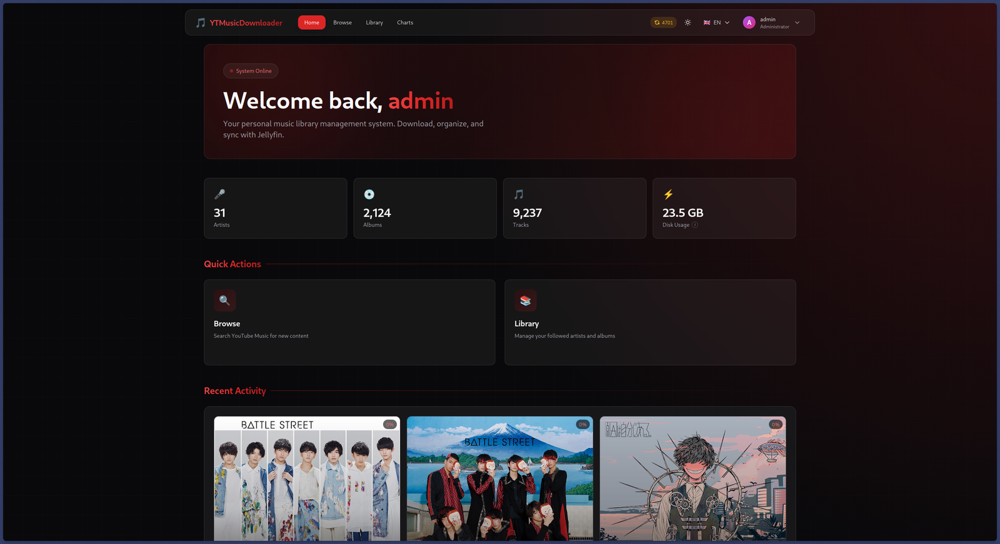

## Features

- **Search YouTube Music** for artists, albums and tracks from a web UI.
- **Follow artists** — all existing releases are downloaded, and new ones are picked up automatically (every 6 h by default).
- **Download single albums** without following the artist.
- **Import a playlist**: paste a YouTube Music playlist URL, then follow every artist in it or download every album it contains in bulk.
- **Charts**: follow a country's music chart and automatically follow its top N artists (re-synced weekly).
- **Synced lyrics** from [LRCLIB](https://lrclib.net), saved as `.lrc` sidecar files. Missing lyrics are retried daily; plain lyrics are upgraded to synced when they become available. Lyrics can also be viewed and edited by hand in the UI.
- **Tagged audio**: M4A/AAC files with title, album, artist, album artist, track number, year and embedded cover art.
- **Jellyfin-friendly layout** with `artist.nfo`, `album.nfo`, `backdrop.jpg` and `cover.jpg`.
- **Multi-user** with three roles (visitor / member / administrator), optional public registration, and httpOnly-cookie sessions.
- **Rate-limit aware**: detects YouTube throttling and bot checks, resets its session, and pauses all downloads with exponential backoff instead of hammering YouTube.
- **Age-restricted tracks** supported via an optional cookies.txt from a signed-in YouTube account (used *only* for those tracks).
- **Backup / restore**: export your followed artists, albums and charts (or a full backup with users and settings) as JSON and import it on another instance, with a dry-run preview.
- **Light / dark theme**, multi-language UI, responsive layout.

## Screenshots

| | |
|:---:|:---:|
| **Browse** — search YouTube Music, or import a playlist<br>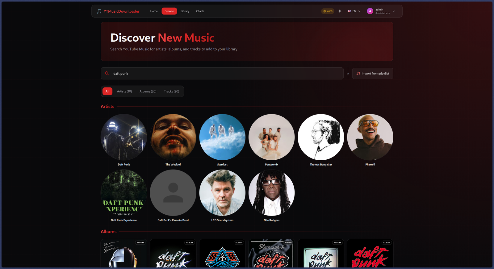 | **Artist** — follow once, every release is tracked<br>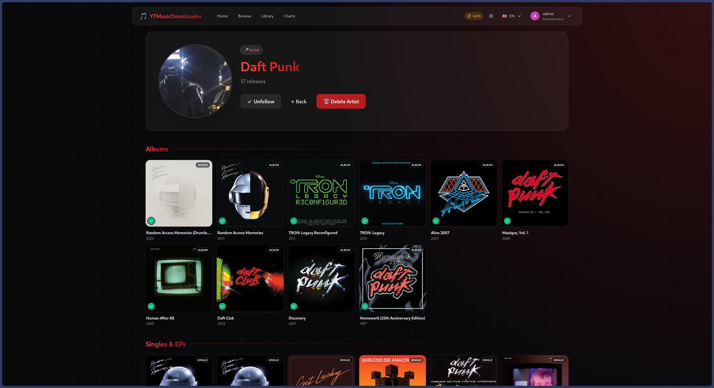 |
| **Album** — per-track download and lyrics status<br>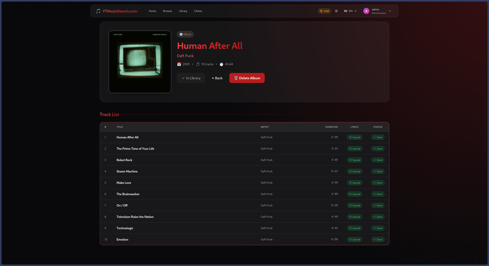 | **Lyrics editor** — view, paste or fix lyrics by hand<br>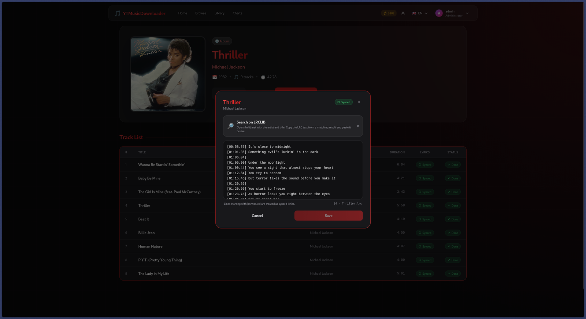 |
| **Library** — progress for every followed artist and album<br>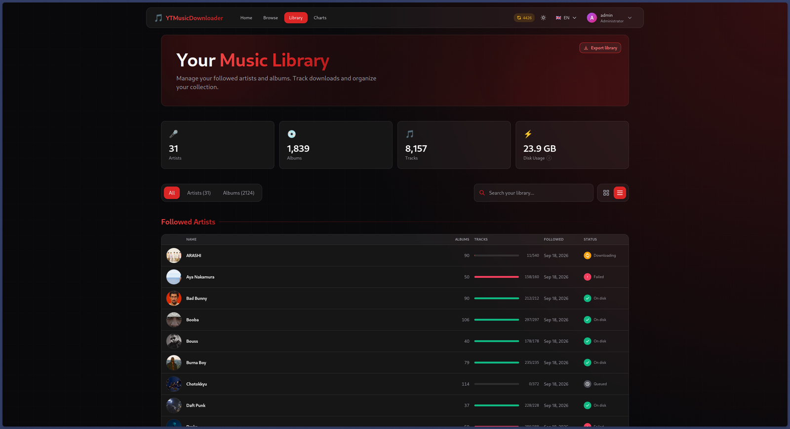 | **Charts** — auto-follow the top artists of a country<br>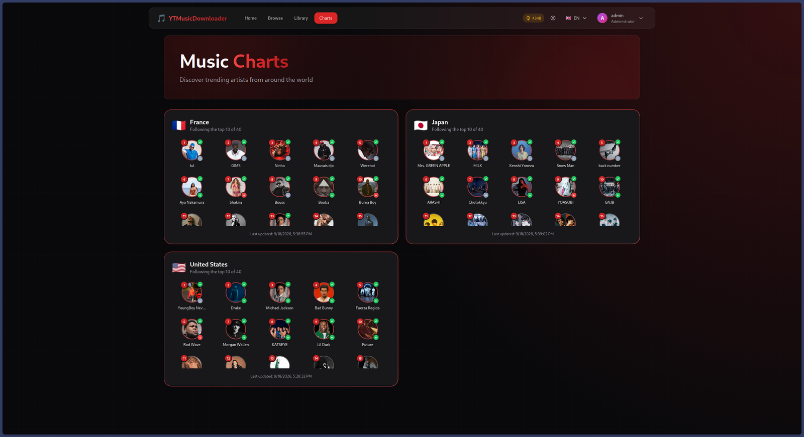 |
| **Admin panel** — backup and restore, users, charts, settings<br>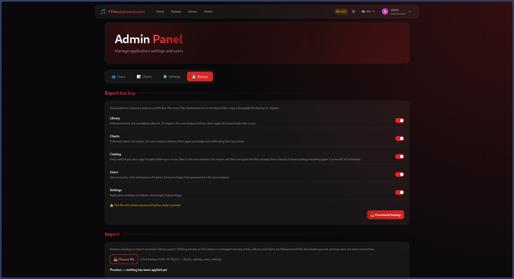 | **Light theme**<br>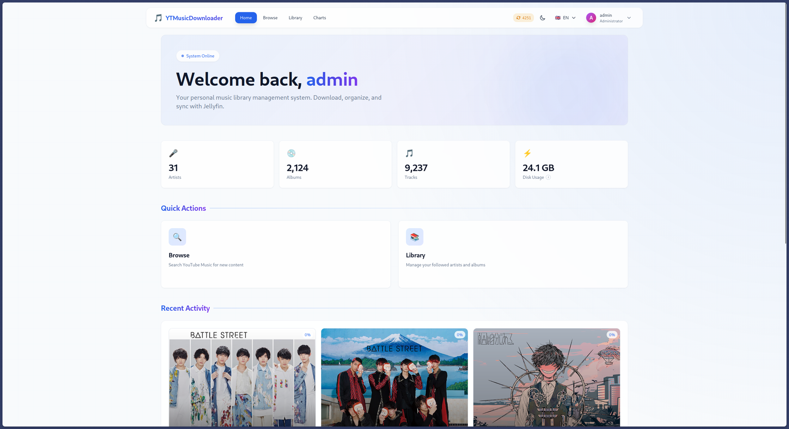 |

<details>
<summary>Mobile</summary>
<p align="center">
  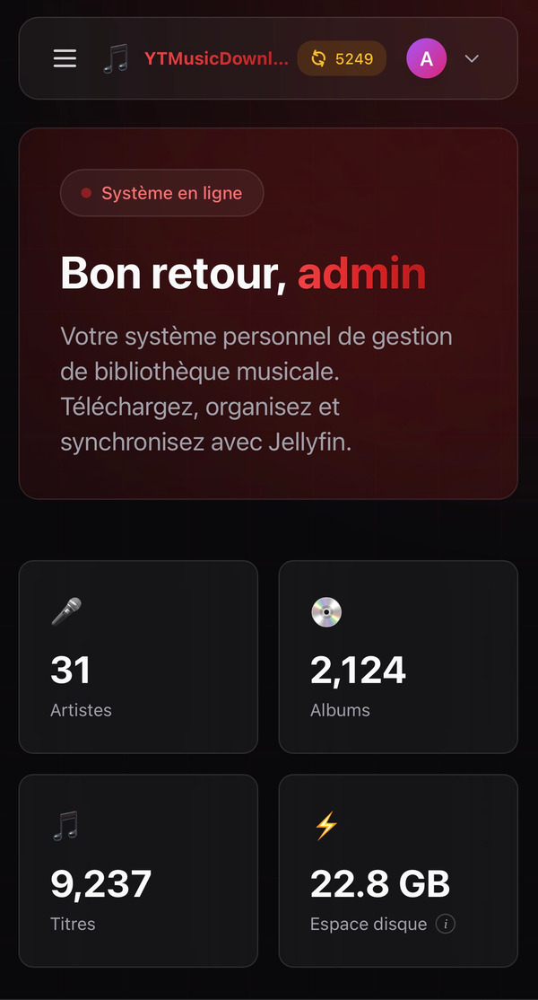
  &nbsp;&nbsp;
  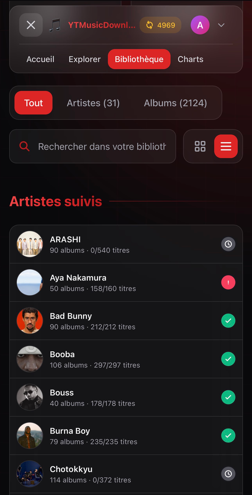
</p>
</details>

## Quick start

Requirements: Docker and Docker Compose.

```bash
git clone https://github.com/patato0705/YTMusicDownloader.git
cd YTMusicDownloader
docker compose up -d --build
```

Open <http://localhost:8000> and sign in with the default account:

- **Username:** `admin`
- **Password:** `default`

**Change this password immediately** (user menu → change password). The first admin is only created when the database is empty; after that, the `FIRST_ADMIN_*` variables are ignored.

The first build takes a few minutes (frontend build + Python dependencies). Subsequent starts are fast.

### Directories

| Host path | Container path | Contents |
|---|---|---|
| `./config` | `/config` | SQLite database, `secrets.json` (JWT secret), logs, caches, temp downloads, YouTube cookie jars |
| `./data` | `/data` | Your music library |

Both are created on first start. Back up `./config` together with `./data` — losing `secrets.json` logs everyone out; losing the database loses the library index (though the *Backup* tab in the admin panel gives you a portable alternative, see below).

### File ownership

The app runs as `PUID:PGID` inside the container (default `1000:1000`), so files it writes to `./config` and `./data` are owned by that user on the host. If `id -u` / `id -g` on your host give different numbers, set them in `docker-compose.yml`.

## How it works

Everything runs in a single Docker container managed by supervisord:

| Process | Role |
|---|---|
| `web` | FastAPI backend + the built React frontend, on port 8000 |
| `worker-download-N` | Downloads audio with yt-dlp (N processes, see `DOWNLOAD_WORKERS`) |
| `worker-metadata` | Talks to YouTube Music: artist syncs, album imports, chart syncs |
| `worker-lyrics` | Fetches lyrics from LRCLIB |
| `scheduler` | Periodic syncs, retries and clean-ups |

All work goes through a job queue stored in SQLite (`/config/db.sqlite`). Workers are split by job family so that a slow download never blocks metadata imports and vice versa. If a worker dies mid-job, the job is requeued automatically.

Following an artist queues a `sync_artist` job → which queues an `import_album` job per release → which queues a `download_track` job per track → which queues a `download_lyrics` job once the audio is on disk.

### Library layout

Files are written to `/data` (bind-mounted from `./data` by default):

```
data/
└── Artist Name/
    ├── artist.nfo
    ├── backdrop.jpg
    └── Album Title/
        ├── album.nfo
        ├── cover.jpg
        ├── 01 - Track Title.m4a
        ├── 01 - Track Title.lrc
        ├── 02 - Track Title.m4a
        └── ...
```

Names are sanitised for the filesystem. Point Jellyfin (or any media server that reads NFO files and folder art) at this directory.

## Configuration

### Environment variables

Set in `docker-compose.yml`. All are optional.

| Variable | Default | Description |
|---|---|---|
| `TZ` | `Europe/Paris` | Timezone for log timestamps |
| `PUID` / `PGID` | `1000` / `1000` | User/group the app runs as (see above) |
| `COOKIE_SECURE` | `false` | Set to `true` when served over HTTPS (behind a TLS-terminating reverse proxy). Leave off for plain HTTP or login won't persist. |
| `DOWNLOAD_WORKERS` | `3` | Number of download worker *processes*. This is a ceiling; how many actually run at once is the *Max concurrent downloads* setting in the admin panel. |
| `CORS_ALLOWED_ORIGINS` | *(empty)* | Comma-separated origins, only needed if you serve the frontend from a different origin than the API. Leave unset for the standard setup. |
| `FIRST_ADMIN_USERNAME` | `admin` | First admin account, created only when the database is empty |
| `FIRST_ADMIN_EMAIL` | `admin@localhost` | |
| `FIRST_ADMIN_PASSWORD` | `default` | |
| `LOG_LOCAL_TIME` | `1` | Set to `0` for UTC log timestamps |

### Admin panel settings

Everything below is changed live from **Admin Panel → Settings**, no restart needed.

| Setting | Default | Description |
|---|---|---|
| Public registration | off | Let anyone create an account (new accounts are *visitors*) |
| Max concurrent downloads | 1 | Parallel YouTube downloads. Capped by `DOWNLOAD_WORKERS`. Every extra stream from one IP raises the odds of being rate-limited. |
| Rate-limit pause | 10 min | How long all downloads stop after a rate limit. Doubles on each consecutive pause (up to 16×) until a download succeeds. |
| Lyrics download | on | Fetch lyrics from LRCLIB for every downloaded track |
| Synced lyrics only | on | Reject plain lyrics; keep retrying for synced ones |
| Charts | on | Enable the Charts page and chart subscriptions |
| Artist sync interval | 6 h | How often each followed artist is checked for new releases |
| Chart sync interval | 168 h | How often each followed chart is re-fetched |
| Lyrics retry interval | 24 h | How often tracks with missing/plain lyrics are retried |
| Job retention | 3 days | Completed jobs older than this are deleted (failed ones are kept) |
| Token cleanup interval | 1 day | How often expired sign-in tokens are purged |
| YouTube Music language | `en` | Language of fetched metadata (bios, descriptions) |
| YouTube account cookies | none | See [Age-restricted tracks](#age-restricted-tracks) |

## Usage

### Users and roles

| Role | Can do |
|---|---|
| **Visitor** | Read-only: browse the library, artists, albums, charts and lyrics. Default for new accounts. |
| **Member** | Everything a visitor can, plus follow/unfollow artists, download albums, edit lyrics. |
| **Administrator** | Everything a member can, plus delete artists/albums (including files), and manage users, charts, settings and backups. |

Admins create users from **Admin Panel → Users**, or enable public registration in Settings.

### Following vs. downloading

- **Follow an artist** (artist page → *Follow*): downloads every release and keeps watching for new ones.
- **Unfollow**: stops watching for new releases. Nothing is deleted; the artist stays in your library in "light" (metadata-only) mode.
- **Download an album** (album page → *Download Album*): grabs just that album. The artist is added to the library in light mode so the album has somewhere to live.
- **Delete artist / album** (admin only): removes the database entries *and* the files on disk.

### Playlist import

On the **Browse** page, click *Import from playlist* (next to the search bar) and paste a YouTube Music playlist URL (or a raw playlist ID). The page lists the unique artists and albums in it, and offers *Follow Main Artists*, *Follow All Artists* and *Download All Albums* bulk actions, plus per-item buttons.

### Charts

Admins follow a country chart from **Admin Panel → Charts** and choose how many of its top artists to follow (1–40). Those artists are followed in full mode. The chart is re-synced on the chart sync interval, following any new entrants. The Charts page shows the current chart for every followed country.

### Lyrics

After a track is downloaded, a `download_lyrics` job queries LRCLIB (cached lookup → exact lookup → fuzzy search with duration matching). Synced lyrics are saved as `<track>.lrc` next to the audio file. Each track has a lyrics badge (synced / plain / none); click it to view, paste or edit lyrics manually. Clearing the text deletes the `.lrc` and lets the next retry sweep query LRCLIB again.

### Age-restricted tracks

Age-restricted videos need a signed-in, age-verified YouTube account. Export a `cookies.txt` (Netscape format — browser extensions such as *Get cookies.txt LOCALLY* do this) while on youtube.com, and upload it under **Admin Panel → Settings → YouTube account cookies**.

The jar is used **only** as a fallback for tracks that fail with an age-gate error — never for ordinary downloads and never to get around a rate limit — so the account sees a handful of requests at most. Still, use a throwaway account, not your main one.

### Rate limiting

Downloads use an anonymous session. When YouTube throttles it ("rate-limited", "confirm you're not a bot", HTTP 429…), the worker discards its cookie jar and retries once with a fresh session. If that still fails, *all* downloads pause (10 min by default, doubling on each consecutive strike) and the navbar shows a banner with the resume time. The affected tracks go back to *queued*, not *failed*. Once a download succeeds the escalation resets.

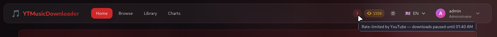

Keeping *Max concurrent downloads* at 1 is the best way to avoid this in the first place.

### Backup and migration

**Admin Panel → Backup** exports a JSON document with any of:

- **Library** — followed artists, standalone albums. On import, the new instance follows them again and downloads their music.
- **Charts** — chart subscriptions.
- **Catalog** — every artist/album/track row with relative file paths. Only useful if you also copy the `data/` folder: the import then recognises files already on disk instead of re-downloading.
- **Users** — accounts, roles and password hashes (keep this file private).
- **Settings** — application settings.

Any user can export the *library* part alone from the Library page (nothing personal in it), which is a handy way to share "here's who I follow" between instances.

Importing first shows a dry-run preview (what would be followed, queued, skipped) and only applies on confirmation. Existing data is never overwritten: missing artists/albums/charts are added and their downloads queued; existing users are left untouched.

## Running behind a reverse proxy

Proxy to port 8000 and set `COOKIE_SECURE=true` if the proxy terminates TLS. The frontend and API share one origin, so no CORS configuration is required. The `/api/health` endpoint (no auth) can be used for uptime checks; it returns 503 if the database, ffmpeg/yt-dlp or the data directories are unhealthy.

## API

Interactive OpenAPI docs are served at `/api/docs`. Authentication is JWT: `POST /api/auth/login` returns a short-lived access token (send as `Authorization: Bearer …`) and sets an httpOnly refresh cookie; `POST /api/auth/refresh` gets a new access token.

## Logs

- `docker compose logs -f` — everything, interleaved.
- `./config/logs/` — one rotating file per process (`web.log`, `worker-download-0.log`, `worker-metadata.log`, `worker-lyrics.log`, `scheduler.log`), 5 MB × 3 each.

## Troubleshooting

**Downloads fail across the board right after an update to YouTube** — restart the container. yt-dlp is updated from PyPI at every start; wait a day or two for a yt-dlp release if the restart doesn't help.

**A track fails with an age-restriction error** — upload account cookies (see above). Such tracks are retried once a day.

**Everything is paused with a rate-limit banner** — wait it out; it resolves on its own. If it keeps happening, lower *Max concurrent downloads*.

**Permission errors on `./config` or `./data`** — make sure `PUID`/`PGID` match your host user. Files that already existed before a `PUID` change need a one-time `chown`.

**Login doesn't stick** — if you're on plain HTTP, `COOKIE_SECURE` must be unset or `false`. If you're on HTTPS, set it to `true`.

**I lost `config/secrets.json`** — a new one is generated on start; every user just has to log in again.

## Development

The stack is FastAPI + SQLAlchemy 2 (backend) and React 18 + Vite + Tailwind + TypeScript (frontend).

The backend expects `/config` and `/data` to exist and be writable (paths are fixed in `backend/config.py`), so the simplest workflow is to run the backend in Docker and only iterate on the frontend:

```bash
docker compose up -d            # backend on :8000
cd frontend
npm install
npm run dev                     # Vite dev server, proxies /api to :8000
```

To run the backend natively (Python 3.11, ffmpeg on PATH, `/config` and `/data` writable):

```bash
pip install -r backend/requirements.txt
uvicorn backend.main:app --reload            # API
python -m backend.jobs.worker                # a worker (WORKER_JOB_TYPES to scope it)
python -m backend.scheduler                  # the scheduler
```

The frontend is built into `backend/static/` by the Dockerfile; the API serves it as an SPA with `/api/*` taking precedence.

Translations live in `frontend/src/locales/`; adding a language is a new JSON file plus one line in `frontend/src/config/i18n.ts`.

## Disclaimer

This tool is intended for personal use with content you have the right to download. Downloading from YouTube may violate YouTube's Terms of Service; you are responsible for how you use it. The project is not affiliated with YouTube or Google.

## License

This project is licensed under the [GNU Affero General Public License v3.0](LICENSE) (AGPL-3.0).

In short: you're free to use, modify, self-host and redistribute it, including commercially — but any modified version you distribute *or run as a service for others* must be released under the same license, with its source code available. See the [LICENSE](LICENSE) file for the full terms.
